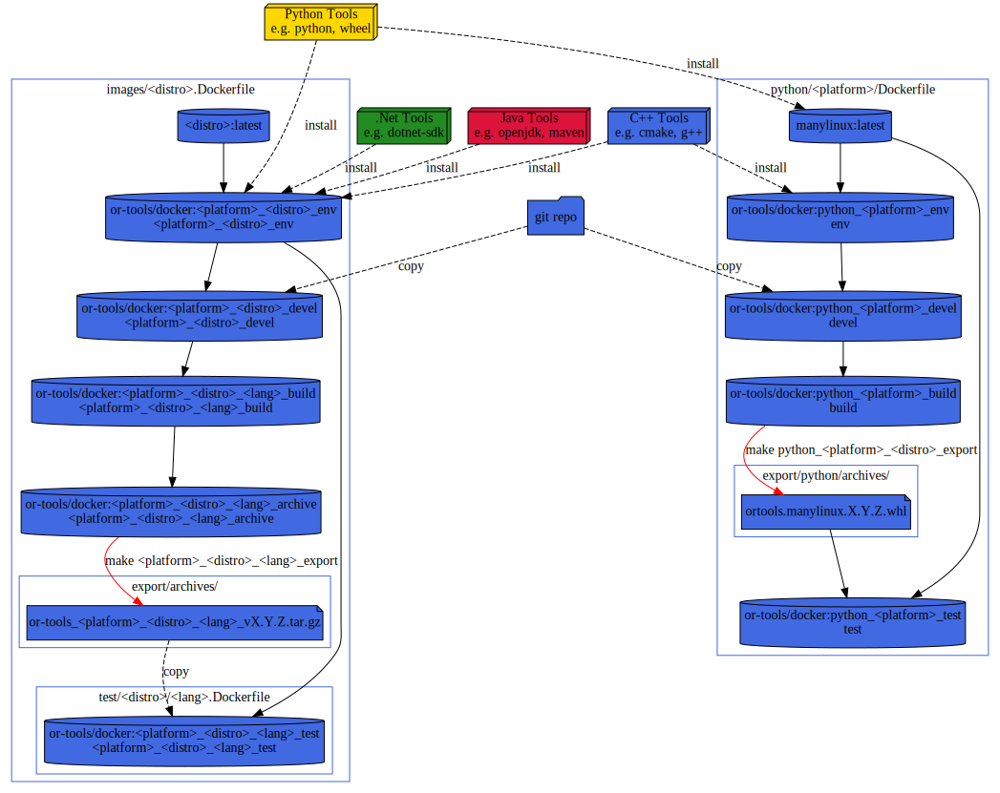

# CI: Makefile/Docker testing

To test the build on various distro, we are using docker containers and a
Makefile for orchestration.

pros:
* You are independent of third party CI runner config (e.g. github actions
  runners).
* You can run it locally on any unix system.
* Most CI provide runner with docker and Makefile installed.

cons:
* Only GNU/Linux distro supported.
* Could take few GiB (~50 GiB for all distro and all languages)
  * ~500MiB OS + C++/CMake tools,
  * ~150 MiB Python, wheel.

## Usage

To get the help simply type:
```sh
make
```

note: you can also use from top directory
```sh
make --directory=tools/docker
```

### Example

For example to test inside an `Alpine` container:
```sh
make alpine-edge_test
```

## Docker layers

Dockerfile is split in several stages.



Legend:

* `<platform>`: amd64, arm64, riscv64.
* `<distro>`: alpine-edge, archlinux, centos, debian, fedora, opensuse, ubuntu.
* `<lang>`: cpp, dotnet, java, python.

### Docker `aarch64` on `x86_64` machine

You can build and run aarch64 docker container on a `x86_64` by enabling qemu
support:

```sh
docker run --rm --privileged multiarch/qemu-user-static --reset -p yes
```

To test:

```sh
docker run --platform linux/arm64 --rm --init -it ubuntu:latest bash -c "uname -a"
```

ref:

* https://github.com/docker-library/official-images#architectures-other-than-amd64
* https://github.com/multiarch/qemu-user-static#getting-started
